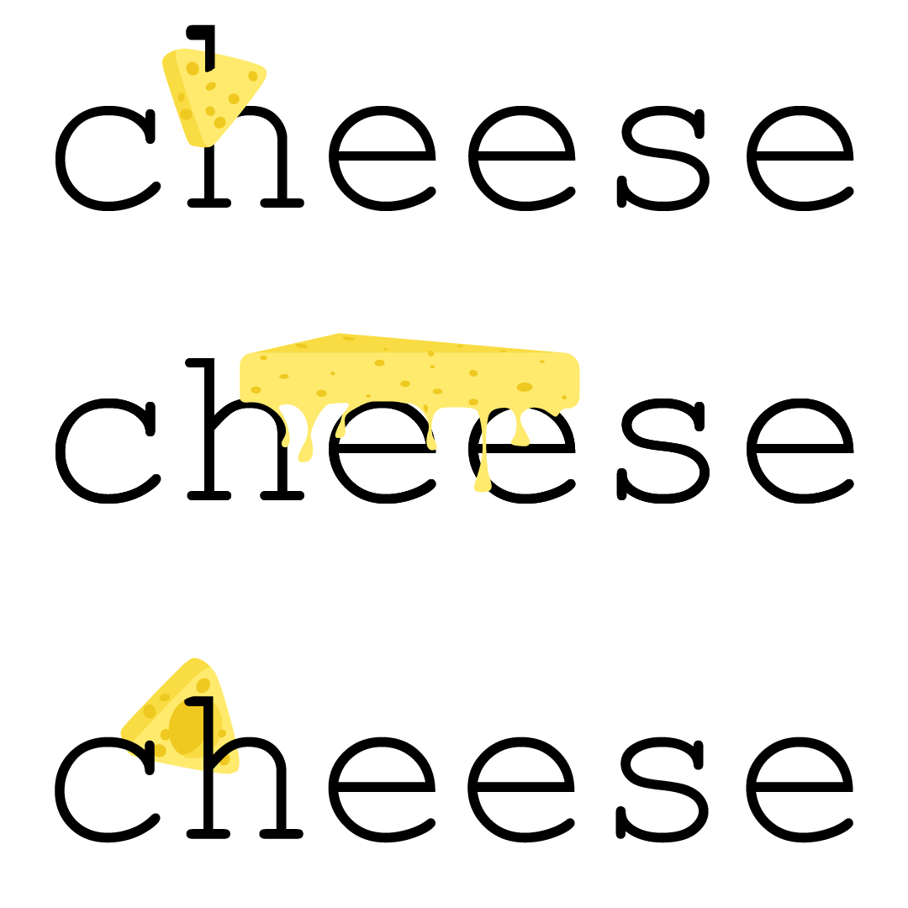

<!-- README.md is generated from README.Rmd. Please edit that file -->

```{r, include = FALSE}
knitr::opts_chunk$set(
  collapse = TRUE,
  comment = "#>",
  fig.path = "man/figures/README-",
  out.width = "100%"
)
```
# 

<!-- badges: start -->
[](https://cran.r-project.org/package=cheese)

<!-- badges: end -->

# Introduction
The `cheese` package contains tools for working with data during statistical analysis--promoting flexible, intuitive, and reproducible workflows. There are functions designated for specific statistical tasks such as

* `univariate_table()`: To create a custom table of descriptive statistics for a dataset
* `univariate_associations()`: For computing pairwise association metrics for combinations of `predictors` and `responses`
* `descriptives()`: To compute descriptive statistics on columns of a dataset

These are built on a collection of data manipulation tools designed for general use, many of which are motivated by the functional programming concept (i.e. `purrr`) and use non-standard evaluation for column selection as in `dplyr::select`. Here are a few:

* `depths()`: Find the depth(s) of elements in a list structure that satisfy a predicate
* `divide()` and `fasten()`: Split/bind data frames to/from any list depth
* `dish()`: Evaluate a function with pairwise combinations of columns
* `stratiply()`: Evaluate a function on subsets of a data frame
* `typly()`: Evaluate a function on columns that inherit at least one (or none) of the specified classes

# Installation

*   From CRAN (current version 0.0.3)

`install.packages("cheese")`

*   From source (in development)

`devtools::install_github("zajichek/cheese")`

# Examples

## Creating a table of descriptive statistics

```{r}
#Load package
require(cheese)

#Set a render format
format <- "markdown" #Could be "html" (default), "latex", "pandoc", or "none"

#Default
heart_disease %>%
  univariate_table(
    format = format
  )
#Use formulas to stratify 
heart_disease %>%
  univariate_table(
    format = format,
    strata = ~ Sex,
    add_n = TRUE
  )
#Use string templates to customize cell appearance
heart_disease %>%
  dplyr::select_if(is.numeric) %>%
  univariate_table(
    format = format,
    numeric_summary = 
      c(
        `Median (Q1, Q3)` = "median (q1, q3)",
        `Mean (SD)` = "mean (sd)"
      ),
    all_summary = 
      c(
        `# missing` = "missing of length"
      )
  )
```


## General functions
```{r}
#Run stratified multiple regression models for multiple outcomes
models <-
  heart_disease %>%
  
  #Within each sex
  stratiply(
    by = Sex,
    f =
      ~.x %>%
      
      #Regress some outcomes on all other variables
      dish(
        left = c(ExerciseInducedAngina, HeartDisease),
        right = -c(ChestPain, ExerciseInducedAngina, HeartDisease),
        each_right = FALSE,
        f = function(y, x) glm(y ~ ., data = x, family = "binomial")
      )
  )

summary(models$Female$HeartDisease)

#Find the depths of the list structure that are glm's
model_depth <-
  models %>%
    depths(
      predicate = some_type,
      types = "glm"
    )
model_depth

#Gather model effect estimates
model_effects <-
  models %>%
  
  #For each model
  purrr::map_depth(
    .depth = model_depth,
    ~.x %>%
      
      #Collect model coefficients into a tibble
      purrr::pluck("coefficients") %>%
      tibble::enframe(
        name = "Term",
        value = "Estimate"
      )
  ) %>%
  
  #Bind rows up to the stratification variable
  fasten(
    into = "Outcome",
    depth = 1
  )
model_effects
```
